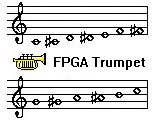

# FPGA-Trumpet-Practice-Tool
Trumpet practice tool implemented in Verilog HDL on the DE1 SoC for the ECE241 Course at the University of Toronto. This project is done in collaboration with Tony Luo.

## Inspiration
It is difficult for beginner trumpet players to play using the right air flow and remember the fingering for each note, as some notes have the same fingering, but have different air flow requirements.

## What it does
The digital circuit takes input from a microphone and the DE1-SoC's KEY[3:1] and process it to determine what note should be played. A speaker then outputs sounds of pre-recorded trumpet notes. A monitor displays all notes from C4 to C5. When a note is played, the corresponding note lights up on the monitor.

## How we built it
All the digital circuits in the FPGA were written in Verilog Hardware Description Language, on the Altera DE1-SoC Board with Cyclone V FPGA by Intel. 
1. Created different modules for audio in and audio out by sending and processing the signals received from the Altera University Audio Controller. 
2. Initialized on chip memory for pre-recorded audio and images to be displayed on the monitor through VGA. 
3. Processed the Microphone input through the use of an averaging algorithm by counting the number of times the audio input waveform's amplitude is above a threshold value. This is done for multiple threshold values and the highest one is used for the air flow to determine which trumpet note is played. 

## Challenges
It is extremely hard to simulate/ test audio, as simulating it in model sim would give us a number, however this number does not tell us what the audio would sound like. A lot of manual testing was done using the HEX display on the DE1-SoC board. We also tested a lot of different MIF (memory initialization) files to attempt to increase the quality of sound output. 
